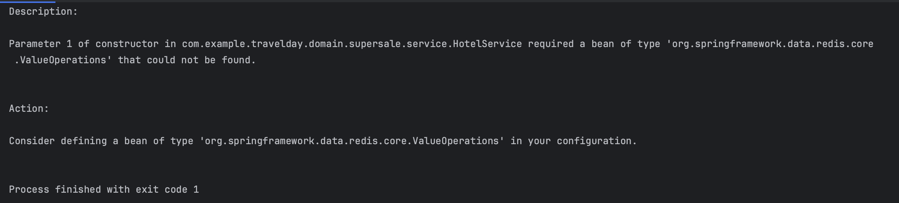

# TIL
## 날짜: 2024-08-15

### 스크럼
* amadeus api에서 가져온 데이터에서 필요한 데이터만 정제하기
* redis 사용해서 호텔 정보 캐싱해놓기

### 오류일지
아래 코드는 호텔 정보를 조회하는 코드이다. 로그를 찍어보니 hotelResDto에 데이터가 잘 담겨있는데 응답 자체는 'Internal Server Error'가 떴다.
```
@Slf4j
@AllArgsConstructor
@Service
public class HotelService {

    private final AmadeusConnect amadeusConnect;

    public List<HotelResDto> getHotelsByGeocode(double latitude, double longitude) {
        try {
            List<Hotel> result = List.of(amadeusConnect.hotelsByGeocode(latitude, longitude));

            List<String> hotelIds = result.stream()
                    .map(Hotel::getHotelId)
                    .toList();
            
            List<HotelOfferSearch> hotelOffers = List.of(amadeusConnect.hotelOffers(hotelIds));
            List<HotelResDto> hotelResDto = new ArrayList<>();

            for (HotelOfferSearch offer : hotelOffers) {
                hotelResDto.add(HotelResDto.of(offer));
            }

            return hotelResDto;
        } catch (ResponseException e) {
            log.info(e.getMessage());
            throw new CustomException(ErrorCode.FAIL_TO_GET_HOTEL_INFO);
        }
    }
}
```

이를 해결한 방법은 HotelResDto에서 @Data 를 붙여주지 않아서였다. HotelResDto에는 붙여줬지만 내부 클래스인 Room 과 Price에는 붙여주지 않아서 발생했던 오류였다.

```
@Data
@Builder
public class HotelResDto {

    @Comment("호텔 아이디")
    private String hotelId;

    @Comment("위도")
    private double latitude;

    @Comment("경도")
    private double longitude;

    @Comment("도시 코드")
    private String cityCode;

    @Comment("이용 가능 여부")
    private boolean available;

    @Comment("호텔 정보 제공")
    private Offer offer;

    @Data
    @Builder
    public static class Offer {

        @Comment("체크인 날짜")
        private String checkInDate;

        @Comment("체크아웃 날짜")
        private String checkOutDate;

        @Comment("방 정보")
        private Room room;

        @Comment("가격 정보")
        private Price price;
    }

    @Data
    @Builder
    public static class Room {

        @Comment("방 타입")
        private String type;

        @Comment("방 세부 타입")
        private TypeEstimated typeEstimated;
    }

    @Data
    @Builder
    public static class TypeEstimated {

        @Comment("침대 수")
        private double beds;

        @Comment("침대 유형")
        private String bedType;
    }

    @Data
    @Builder
    public static class Price {

        @Comment("통화")
        private String currency;

        @Comment("호텔 총 가격")
        private String total;
    }

    public static HotelResDto of(HotelOfferSearch hotel) {
        return HotelResDto.builder()
                .hotelId(hotel.getHotel().getHotelId())
                .latitude(hotel.getHotel().getLatitude())
                .longitude(hotel.getHotel().getLongitude())
                .cityCode(hotel.getHotel().getCityCode())
                .available(hotel.isAvailable())
                .offer(Arrays.stream(hotel.getOffers())
                        .findFirst()
                        .map(offer -> Offer.builder()
                            .checkInDate(offer.getCheckInDate())
                            .checkOutDate(offer.getCheckOutDate())
                            .room(Room.builder()
                                    .type(offer.getRoom().getType())
                                    .typeEstimated(TypeEstimated.builder()
                                            .beds(offer.getRoom().getTypeEstimated().getBeds())
                                            .bedType(offer.getRoom().getTypeEstimated().getBedType())
                                            .build())
                                    .build())
                            .price(Price.builder()
                                    .currency(offer.getPrice().getCurrency())
                                    .total(offer.getPrice().getTotal())
                                    .build())
                            .build())
                        .orElse(null))
                .build();
    }
}
```
### 오류 일지2


Consider defining a bean of type 'org.springframework.data.redis.core.ValueOperations' in your configuration.

위 오류를 보고 redis 설정 파일을 열어보았다. 알고보니 나는 redis에 key값은 String으로 value값은 List<HotelResDto>으로 넣으려고 했다. 하지만 설정 파일에는 <String, String> 으로 되어있어 오류가 난 것이었다.
내일 백엔드 팀원과 함께 논의해야할 것 같다.
```
    @Bean
    public RedisTemplate<String, String> redisTemplate(LettuceConnectionFactory redisConnectionFactory) {
        RedisTemplate<String, String> redisTemplate = new RedisTemplate<>();
        redisTemplate.setConnectionFactory(redisConnectionFactory);

        // 일반적인 key:value의 경우 시리얼라이저
        redisTemplate.setKeySerializer(new StringRedisSerializer());
        redisTemplate.setValueSerializer(new StringRedisSerializer());

        // Hash를 사용할 경우 시리얼라이저
        redisTemplate.setHashKeySerializer(new StringRedisSerializer());
        redisTemplate.setHashValueSerializer(new StringRedisSerializer());

        // 모든 경우
        redisTemplate.setDefaultSerializer(new StringRedisSerializer());

        return redisTemplate;
    }
```

