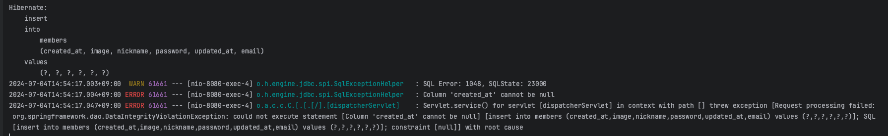
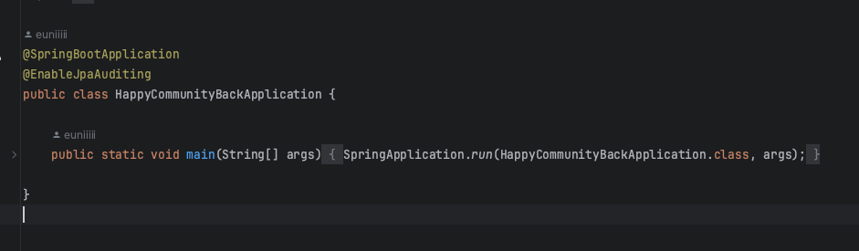
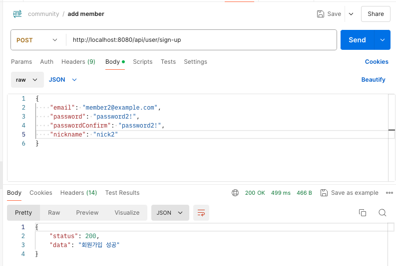

# TIL
## 날짜: 2024-07-04

### 스크럼
* 커뮤니티 (스프링부트)
  * 회원 구현

### 학습 내용
회원 구현까지는 다 해서 postman으로 테스트를 시작했다.

먼저, 게시글 목록은 로그인을 안해도 가져올 수 있도록 했고, 이어서 회원가입 테스트를 하려는데 에러가 났다. 닉네임 중복을 테스트할 때에는 "닉네임 중복"이라는 에러를 잘 응답이 왔지만 제대로 값을 입력했을때 "성공"이 뜨지않고 잘못도니 오류코드가 응답으로 왔다.

created_at이 null이면 안된다고 떴다. 해결 방법은 JPA Auditing 기능을 활성화시키는 것이었다. 이는 데이터베이스에서 엔티티 객체의 변경 이력을 추적하는 기능을 제공하는 기술이라고 한다.

메인 설정 클래스에 @EnableJpaAuditing을 달아줌으로써 auditing을 활성화시켰다.

그 결과 회원가입 성공이 잘 떴다. db도 확인해보니 잘 저장이 되었다!

### 오늘의 회고
처음에 시큐리티 설정이 잘못된 줄 알고 그곳에만 집중을 했었어서 시간을 많이 썼다. 디버깅하는법을 배웠지만 콘솔창에서 어느 부분이 잘못되었는지 찾을 수 있었다. 오류가 났을 때 당황하지 않고 스스로 오류 찾는 능력이 길러야할 것 같다.