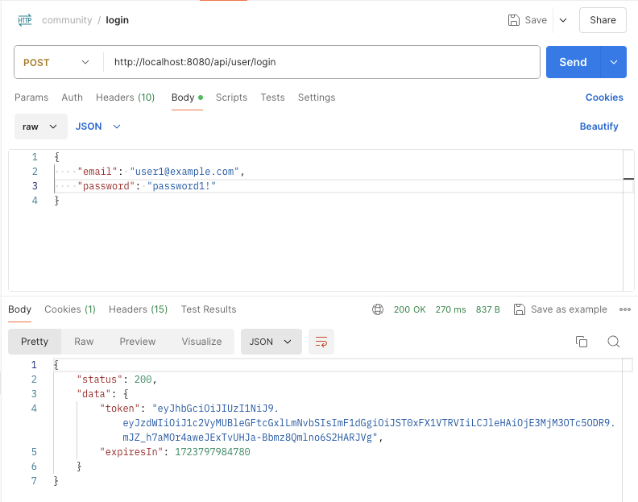
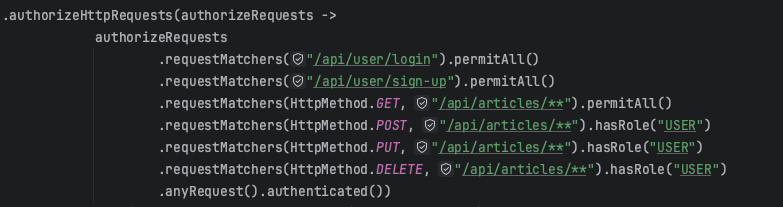

# TIL
## 날짜: 2024-07-05

### 스크럼
* 커뮤니티 (스프링부트)
  * postman으로 테스트 해보기
  * 오류나는 부분 수정하기
* 딥다이브
* 알고리즘

### 학습 내용
로그인을 해도 로그인이 필요하다는 응답이 오는 오류가 났다. 알고보니 jwt secret 키를 안 넣어줘서 그랬다. application-my.yml에 jwt secret 키를 지정해줬지만 또 같은 오류가 났다. 알고보니 jwtProvider의 @Value 쪽에 오타가 나서 그런거였다.

그리고 로그인 안 된 상태에서 볼 수 있는 페이지들에 대해 설정을 다시 해줬다.

게시글 목록 조회와 게시글 상세 조회에 대해서는 로그인이 되어있지 않아도 응답이 잘 왔다.

하지만 로그인이 필요한 페이지에 로그인을 하고 접근을 해도 "로그인이 필요하다"는 응답이 떴다. 주말동안 공부하고 수정할 예정이다.

### 오늘의 회고
딥다이브 때 MSA와 MA에 대해 공부하고 발표했다. 들어본 적은 있지만 공부는 처음했지만 잘 이해가 되었다. 하지만 팀원들이 맡은 주제들은 조금 어려웠다. 다른 주제들에 대해서도 공부해야할 것 같다.

### 참고자료 및 링크
[🔗](https://www.notion.so/goorm/3-MSA-MA-MSA-fa73a3b3f093491ca7a4271a70a27eba) 딥다이브 - MA와 MSA

[🔗](https://github.com/ss0ming/Programmers/tree/main/%EB%B0%B1%EC%A4%80/Silver/2667.%E2%80%85%EB%8B%A8%EC%A7%80%EB%B2%88%ED%98%B8%EB%B6%99%EC%9D%B4%EA%B8%B0) 알고리즘 - 단지번호 붙이기 (BOJ)