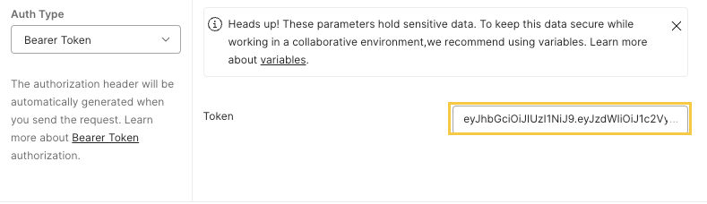

# TIL
## 날짜: 2024-07-07

### 학습목표
* 알고리즘 풀기
* 스프링부트 - 커뮤니티
  * 테스트 -> 로그인 오류 잡기
  * 게시글 CRUD 수정

### 학습내용
* 알고리즘
 
두스티커는 처음에 dfs로 풀려고 했다. 제시된 테스트 케이스는 통과를 했지만 막상 넣어보니 틀렸다고 떴다. 몇 번 더 시도를 했지만 틀렸다고 떠서 이중 for문을 써서 전체 탐색을 해 풀었다. dfs로 푸는 방법도 더 공부를 해봐야할 것 같다.
 
 
ABCDE는 문제 푸는 방향은 잘 잡았지만 디테일이 부족했던 것 같다. 디테일을 잡는데 좀 시간을 많이 써버렸다.

* 스프링부트 - 커뮤니티
 
로그인 후에 게시글 추가하려 하니까 "INVALID_ACCESS_TOKEN"이 응답으로 왔다. 알고보니 postman에서 테스트를 할 때 토큰을 넣어주는 곳에 Bearer을 앞에 붙여서 그랬다. 아래 노란 박스처럼 토큰만 넣어주면 자동으로 붙여준다.
 
 

 
게시글 추가의 경우 게시글을 추가한 회원의 정보를 추가해줘야 하기 때문에 현재 로그인한 회원의 정보를 가져와 추가해주도록 수정했다.
나머지 게시글 CRUD도 테스트하여 오류가 나는 부분들을 수정해줬다. 내일은 댓글 CRUD를 테스트 해보며 수정할 예정이다.

### 참고자료 및 링크
[🔗](https://github.com/ss0ming/Programmers/tree/main/%EB%B0%B1%EC%A4%80/Silver/16937.%E2%80%85%EB%91%90%E2%80%85%EC%8A%A4%ED%8B%B0%EC%BB%A4) 두스티커 (BOJ)

[🔗](https://github.com/ss0ming/Programmers/tree/main/%EB%B0%B1%EC%A4%80/Gold/13023.%E2%80%85ABCDE) ABCDE (BOJ)

[🔗](https://github.com/ss0ming/happy_community_back) 스프링부트 - 커뮤니티