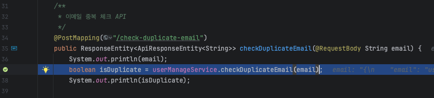
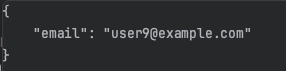
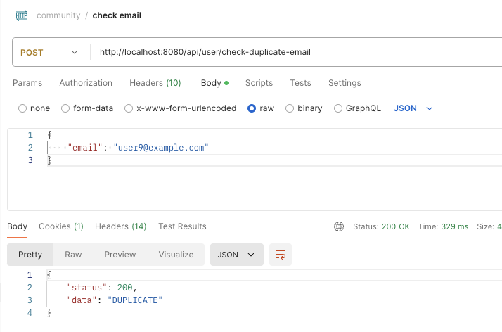
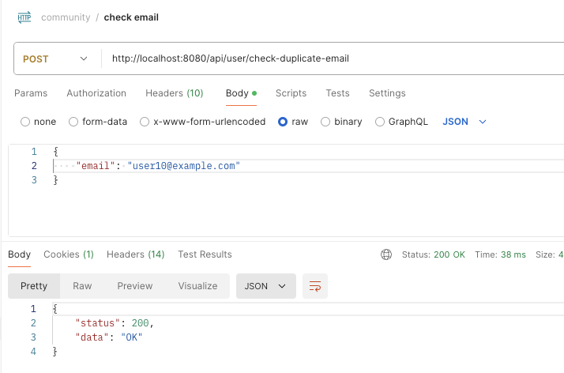

# TIL
## 날짜: 2024-07-09

### 스크럼
* 커뮤니티(백)
  * 이메일과 닉네임 중복 확인 부분 중복이어도 "OK"를 보내는 현상 수정하기
* 면접 스터디 준비 - 운영체제, 스케줄링

### 학습 내용
#### 💡 문제 상황 1
이메일과 닉네임 중복 확인 부분 중복이어도 중복이 아니어도 "OK"를 보내는 현상이 일어났다.

#### 🔍 해결 방안 1

디버깅을 해보니 저 json 문자열로 넣어서 그런거였다.

이메일과 닉네임에 대한 ReqDto를 생성해주고 다시 시도했다.

이제 잘 된다. 자연스럽게 dto를 쓰다가 이번에는 어차피 RequestBody로 하나만 들어오는데 하면서 바로 String email 혹은 String nickname으로 했던거 같다. 이번 오류를 통해서 dto의 역할을 확실히 알게된 것 같다.

### 커뮤니티 진행 상황
### 📌 회원
✅ 회원가입 
✅ 로그인 
✅ 로그아웃 
비밀번호 수정 
닉네임 수정

### 📌 게시글
게시글 목록 조회 
게시글 단일 조회 
게시글 등록 
게시글 수정 
게시글 삭제

### 📌 댓글
댓글 목록 조회 
댓글 등록 
댓글 수정 
댓글 삭제

### 참고자료 및 링크
[🔗](https://velog.io/@euniiiii/%EC%9A%B4%EC%98%81%EC%B2%B4%EC%A0%9C-%EC%9A%B4%EC%98%81%EC%B2%B4%EC%A0%9C%EB%9E%80) 운영체제란?

[🔗](https://velog.io/@euniiiii/%EC%9A%B4%EC%98%81%EC%B2%B4%EC%A0%9C-%EC%84%A0%EC%A0%90%ED%98%95%EA%B3%BC-%EB%B9%84%EC%84%A0%EC%A0%90%ED%98%95-%EC%8A%A4%EC%BC%80%EC%A4%84%EB%A7%81) 스케줄링