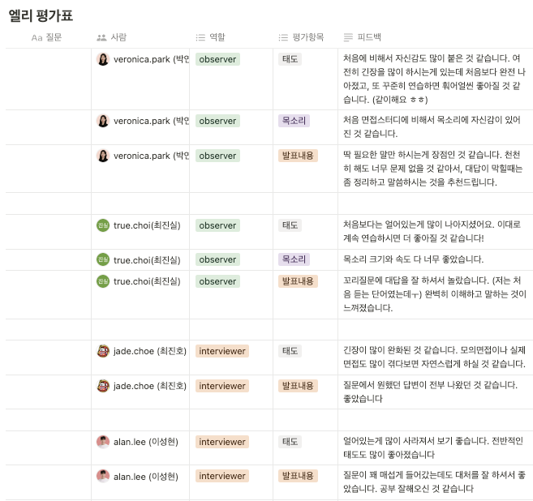

# TIL
## 날짜: 2024-07-11

### 스크럼
* 면접 스터디 - 운영체제
* 프론트, 백 연결 
* 알고리즘

### 오늘의 회고
게시글 목록 조회 테스트를 진행했고 잘 작동되었다. 게시글 상세 조회에서 막혔는데 프론트 쪽에서 데이터를 받지 못 한다. 내일 오류를 잡아야할 것 같다.

면접 스터디를 진행했다. 운영체제를 어려워하는 편인데 스터디를 진행하면서 개념들을 따로따로 알고 있었는데 연결시킬 수 있는 시간이 되었던 것 같다. 

### 커뮤니티 진행 상황
### 📌 회원
✅ 회원가입 
✅ 로그인 
✅ 로그아웃 
비밀번호 수정 
닉네임 수정

### 📌 게시글
✅ 게시글 목록 조회 
게시글 단일 조회 
게시글 등록 
게시글 수정 
게시글 삭제

### 📌 댓글
댓글 목록 조회 
댓글 등록 
댓글 수정 
댓글 삭제

### 참고자료 및 링크
[🔗](https://velog.io/@euniiiii/BOJ-2579-%EA%B3%84%EB%8B%A8-%EC%98%A4%EB%A5%B4%EA%B8%B0) BOJ - 계단 오르기