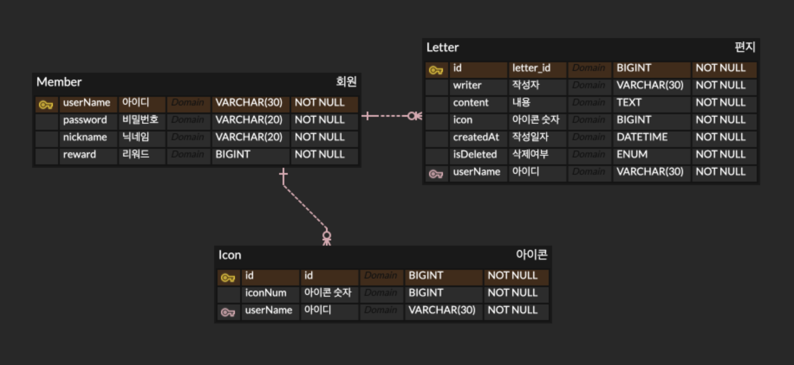

# TIL
## 날짜: 2024-07-12

### 스크럼
* 리액트, 스프링부트 연결
  * 게시글 상세 조회 테스트하면서 수정하기
* 자기소개서 및 포트폴리오 작성
* Levian 프로젝트 기획
  * 아이디어 회의
  * ERD 설계
  * API 명세서 작성

### 오늘의 회고
리액트와 스프링부트 연결은 게시글 상세 조회까지 되었다. 이미지 넣고 가져오는 부분까지 하려고 시도했지만 디비에 image가 null로 담겨져서 수정해야할 것 같다. 

Levian 프로젝트에 대해 회의와 기획을 진행했다. 백엔드를 맡았고 ERD와 API 명세서를 작성했고 개발 시 맞춰야 할 부분에 대해 백엔드 맡은 팀원들과 논의했다.

### 참고자료 및 링크
[🔗](https://docs.google.com/spreadsheets/d/1GkzSbYENJ2QrutCEhzvXH6kHHbNtiQ02SlPOmF1ZxJM/edit?gid=0#gid=0) Levian - API 명세서
