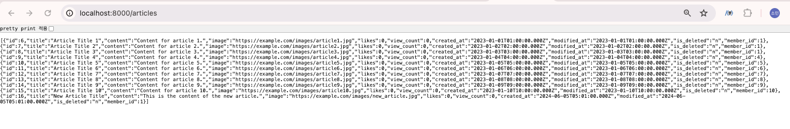

# TIL
## 날짜: 2024-06-10

### 스크럼
* express와 mysql 연결하기

### 학습 내용
mysql을 연결하기 위해 먼저 'npm install mysql2' 명령어를 통해 설치해준다.

아래 코드와 같이 mysql 설정을 해준다.
미리 생성한 데이터베이스와 계정 정보를 입력해준다.

```
import mysql from 'mysql2';

const pool = mysql.createPool({
    host: 'localhost',
    user: 'user',
    password: 'password',
    database: 'db_name'
})

export default pool.promise();
```

아래 코드는 articles 테이블의 데이터를 가져오는 쿼리를 실행하도록 작성한 예시 코드이다.

```
// 게시글 목록 조회
async function getArticleList(req, res) {
    try {
        const [articles] = await db.query('SELECT * FROM articles WHERE is_deleted = "n"');
        res.json(articles);
    } catch (error) {
        console.error('Error fetching articles:', error);
        res.status(500).json({ error: 'Internal server error' });
    }
}
```

결과


### 오늘의 회고
게시글 목록 및 단일 조회, 회원 조회를 mysql과 연결하여 조회하도록 했다.