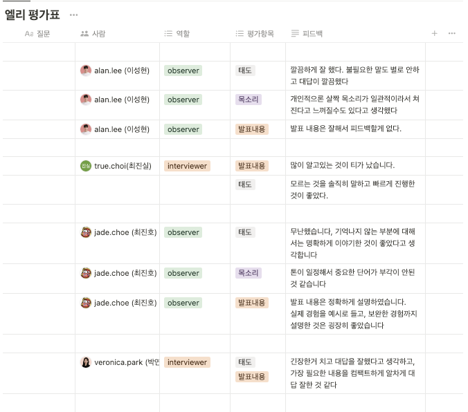

# TIL
## 날짜: 2024-06-16

### 학습 계획
* 팀스터디 - CS 면접스터디
* 알고리즘 2문제 풀기

### 오늘의 회고
3팀이 되고 첫 CS 스터디를 진행했다. 긴장을 많이 하는 편이기도 하고 면접 경험이 많이 없어 많이 떨렸다. 머리가 하얘지는 느낌이 들 때마다 당황스럽고 말을 조금 더듬었다. 자연스럽게 설명하는 연습이 필요할 것 같다. (아래는 팀원들의 피드백이다.)

알고리즘 중 DP 문제를 어려워해서 DP만 2문제를 풀었다. 아직 풀이방법을 금방금방 생각해내지 못하는 것 같아 문제를 풀어보면서 더 연습을 해야할 것 같다.

### 참고자료 및 링크
[🔗](https://github.com/ss0ming/Programmers/tree/main/%EB%B0%B1%EC%A4%80/Gold/1520.%E2%80%85%EB%82%B4%EB%A6%AC%EB%A7%89%E2%80%85%EA%B8%B8) 알고리즘1

[🔗](https://github.com/ss0ming/Programmers/tree/main/%EB%B0%B1%EC%A4%80/Silver/11053.%E2%80%85%EA%B0%80%EC%9E%A5%E2%80%85%EA%B8%B4%E2%80%85%EC%A6%9D%EA%B0%80%ED%95%98%EB%8A%94%E2%80%85%EB%B6%80%EB%B6%84%E2%80%85%EC%88%98%EC%97%B4) 알고리즘2