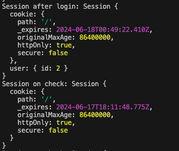
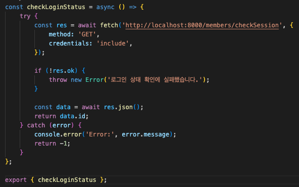
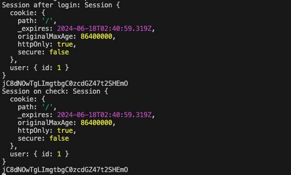

# TIL
## 날짜: 2024-06-17

### 학습 계획
* 세션 확인 안되는 수정하기
* 스프링 부트 과제 시작하기
  * 게시글 CRUD
* 팀 스터디 준비하기(CS 기술 면접 - 컴퓨터네트워크)

### 학습 내용
#### 😬 문제 상황
로그인 시 세션을 만들어 보내고 checkSession을 통해 로그인 상태를 확인하려고 했다.
로그인한 직후에는 세션이 만들어졌고 user 객체에 데이터가 잘 담아졌지만 게시글 상세 조회 페이지로 들어갔을때는 세션에 user 객체가 없었다. <그림 1>

<그림 1. Session after login과 Session on check>

세션 아이디를 로그로 찍어보니 로그인 직후의 세션 아이디와 게시글 상세 조회 페이지에서의 세션확인할 때의 세션 아이디가 달랐다.

#### 💡 해결 방법
프론트 쪽 로그인하기 위해 백으로 보낼 때 credentials: 'include' 추가해줬다.

#### 📌스프링부트 게시판 CRUD: Article, ArticleComment 엔티티 추가
나중에 협업할 때 깃 사용법을 익히기 위해 깃에 project table을 사용해보았다. 그리고 이슈 번호를 붙이고 브랜치를 나누어 진행했다. 많이 익숙하지는 않아서 생각보다 시간이 오래걸렸던 것 같다.

### 참고자료 및 링크
[🔗](https://velog.io/@euniiiii/REST-API) REST API

[🔗](https://github.com/ss0ming/happy_community_back) 커뮤니티 백엔드 (스프링)
