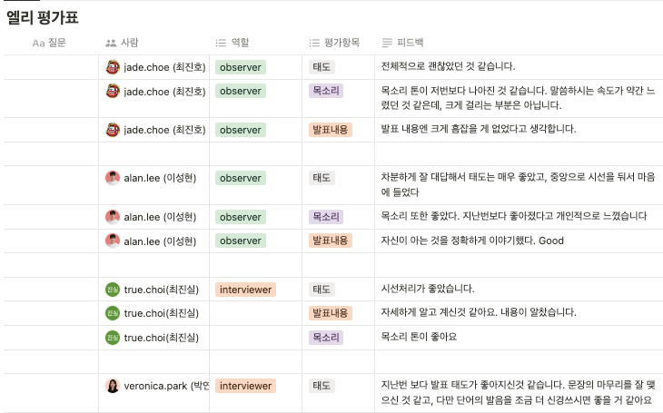

# TIL
## 날짜: 2024-06-20

### 학습 계획
* 어제 했던 실습 정리 및 기록 해놓기
* CS 기술 면접 스터디
* 커뮤니티 프론트 (nodejs) 수정하기

### 오늘의 회고
어제 생각하지 못했던 리전 이슈 때문에 리전을 이전시켰다.

CS 기술 면접 스터디를 진행했다. 면접자가 되어 질문을 받는데 갑자기 용어가 생각나지 않을때가 있었다. 지속적으로 복습하면서 용어에 익숙해져야할 것 같다. 말의 끝맺음을 좀 더 명확하고 깔끔하게 해야할 것 같다.

커뮤니티 프론트를 수정 중에 있다. 게시글 또는 댓글 생성할때 회원 id를 하드코딩 해놓았던 것을 수정했다. 게시글 생성, 삭제, 조회, 댓글 목록 조회, 댓글 생성은 잘 된다. 내일은 게시글 수정, 댓글 단일 조회, 댓글 수정, 댓글 삭제, 회원정보 수정(닉네임, 패스워드) 해야한다.

### 참고자료 및 링크
[🔗](https://velog.io/@euniiiii/AWS-EC2-%EC%83%9D%EC%84%B1) AWS - EC2 생성

[🔗](https://velog.io/@euniiiii/AWS-%EC%84%9C%EB%B2%84%EC%97%90-%ED%86%B0%EC%BA%A3-%EC%84%A4%EC%B9%98) AWS - 서버에 톰캣 설치

[🔗](https://velog.io/@euniiiii/%ED%86%B0%EC%BA%A3-%EB%A6%AC%EB%B2%84%EC%8A%A4-%ED%94%84%EB%A1%9D%EC%8B%9C-%EC%84%A4%EC%A0%95) AWS - 톰캣 리버스 프록시 설정

[🔗](https://velog.io/@euniiiii/AWS-%EC%8A%A4%ED%94%84%EB%A7%81%EB%B6%80%ED%8A%B8-%EC%9B%B9-%ED%94%84%EB%A1%9C%EC%A0%9D%ED%8A%B8-%EB%B0%B0%ED%8F%AC) AWS - 배포