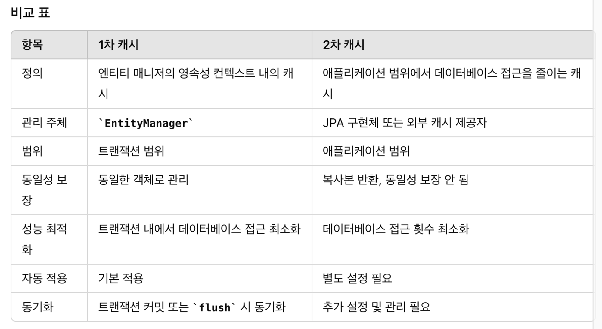

# TIL
## 날짜: 2024-06-21

### 학습 계획
* 딥다이브 - 1차 캐시와 2차 캐시

## 📌 1차 캐시

영속성 컨텍스트 내부에는 **엔티티를 보관하는 저장소**가 있는데, 이를 1차 캐시라고 합니다.

“엔티티 매니저”로 조회하거나 변경하는 모든 엔티티는 1차 캐시에 저장됩니다.

트랜잭션을 커밋하거나 플러시를 호출하면, 1차 캐시에 있는 엔티티의 변경 내역을 데이터베이스에 동기화합니다.

JPA를 Spring Framework 같은 컨테이너 위에서 실행하면 트랜잭션을 시작할 때, 영속성 컨텍스트를 생성하고, 트랜잭션을 종료할 때 영속성 컨텍스트도 종료합니다. 1차 캐시는 끄고 켤 수 있는 옵션이 아닙니다. 영속성 컨텍스트 자체가 사실상 1차 캐시입니다.

### 특징

트랜잭션을 시작하고 종료할 때까짐나 1차 캐시가 유효합니다.

동일한 “엔티티매니저”를 통해 조회된 엔티티는 1차 캐시에 저장합니다.

동일한 엔티티에 대한 반복 조회 시 데이터베이스 조회 대신 1차 캐시에서 조회합니다.

트랜잭션 종료 시 1차 캐시는 소멸합니다.

같은 엔티티가 있으면 **객체 동일성을 보장**합니다.

### 장점

- **성능 향상**
    
    동일한 트랜잭션 내에서 동일한 엔티티에 대한 반복 조회 시 데이터베이스 접근을 줄여 성능을 향상시킵니다.
    
- **일관성 보장**
    
    동일한 `EntityManager` 내에서 동일한 엔티티는 항상 동일한 객체로 관리되므로 일관성이 보장됩니다.
    
- **변경 사항 추적**
    
    엔티티의 변경 사항을 자동으로 추적하고, 트랜잭션 종료 시 변경 사항을 데이터베이스에 반영합니다.
    

### 단점

- **메모리 사용**
    
    트랜잭션 내에서 조회된 모든 엔티티가 1차 캐시에 저장되므로 메모리 사용량이 증가할 수 있습니다.
    
- **트랜잭션 범위 제한**
    
    1차 캐시는 트랜잭션 범위 내에서만 유효하므로, 트랜잭션 외부에서는 사용할 수 없습니다.
    

## 📌 2차 캐시

애플리케이션에서 공유하는 캐시를 JPA는 공유캐시라고 하는데, 일반적으로 2차 캐시라고 부릅니다.

2차 캐시를 적용하면 엔티티 매니저를 통해 데이터를 조회할 때 우선 2차 캐시에서 찾고, 없으면 DB에서 찾습니다.

따라서, 적절히 활용하면 DB 조회 횟수를 획기적으로 줄일 수 있습니다.

많은 JPA 구현체(Hibernate 등)에서 제공하여 애플리케이션 성능을 최적화하는데 사용됩니다.

2차 캐시는 애플리케이션 범위에서 데이터를 캐시하여 데이터베이스 접근을 줄이고 응답 시간을 향상시키는 역할을 합니다.

### 특징

2차 캐시는 동시성을 극대화하기 위해 캐시 한 객체를 직접 반환하지 않고 복사본을 만들어서 반환합니다.

여기서 복사본을 반환하는 이유는 캐시 한 객체를 그대로 반환하면 여러 곳에서 같은 객체를동시에 수정하는 동시성 문제가 발생할 수 있습니다.

이를 해결하기 위해서 객체에 락을 걸어야하는데 이러면 동시성이 떨어질 수 있습니다.

그래서 2차 캐시는 원본 대신에 복사본을 반환합니다.

### 장점

- **성능 향상**
    
    반복적인 데이터베이스 접근을 줄여서 응답 시간을 단축할 수 있습니다.
    
- **네트워크 부하 감소**
    
    데이터베이스 서버와의 네트워크 트래픽을 줄여줍니다.
    
- **확장성**
    
    대규모 애플리케이션에서 데이터 접근 성능을 향상시킵니다.
    

### 단점

- **일관성 문제**
    
    데이터베이스와 캐시 간의 데이터 일관성을 유지하는 것이 어려울 수 있습니다.
    
    영**속성 컨텍스트가 다르면 객체 동일성을 보장하지 않습니다.**
    
- **복잡성 증가**
    
    2차 캐시를 설정하고 관리하는 과정이 복잡할 수 있습니다.
    
- **메모리 사용 증가**
    
    캐시 데이터가 메모리를 차지하므로 메모리 사용량이 증가합니다.
    

## 🔍 1차 캐시와 2차 캐시 한눈에 보기

### 오늘의 회고
1차 캐시와 2차 캐시에 대해 공부하고 발표하는 시간을 가졌다. 내가 공부한만큼 팀원들에게 잘 설명하지 못한 것 같아 조금 아쉬웠다. 다른 사람에게 설명하는 연습을 조금 더 해야할 것 같다.