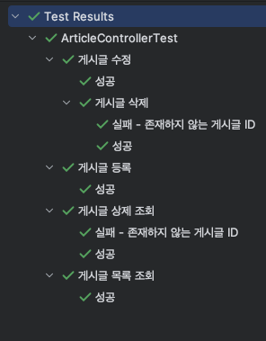
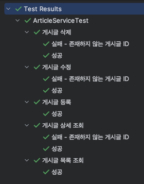

## 날짜: 2024-06-26

### 학습 계획
* 리눅스 명령어 및 도커 강의
* 스프링부트 커뮤니티 - 게시판 구현
* CS 스터디 준비 - 스프링 공부하기

### 오늘의 회고
ArticleService 테스트 코드를 작성했는데 ArticleController 테스트를 해봐서 그런지 속도가 더 빨라졌다. 
테스트는 모두 통과했고 코드는 참고자료에 첨부했다.

오전에는 리눅스 명령어에 대해 배웠고 저번주 EC2 실습할 때 사용했던 명령어들을 정리했다.

도커 실습으로 도커 설치하고 도커 이미지 생성를 했다. 중간에 build가 안되어서 gradle 열고 clean하고 build 했더니 jar파일이 잘 생성되었고 도커 이미지가 잘 생성되었다. 내일 도커 실습을 정리해서 velog에 올릴 예정이다.

### 참고자료 및 링크
[🔗](https://www.notion.so/goorm/ellie-26db34e5fd3b4ab9b8cc0bf01adae772) 리눅스 명령어 정리

[🔗](https://github.com/ss0ming/happy_community_back) 커뮤니티 - back (SpringBoot)