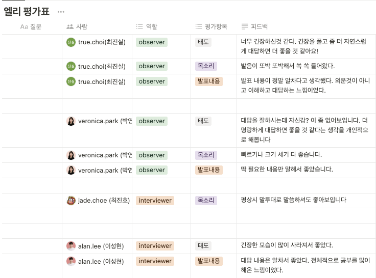

## 날짜: 2024-06-27

### 학습 계획
* 도커 실습 정리해서 velog에 올리기
* 알고리즘 풀기
* CS 기술 면접 스터디 - Spring

### 오늘의 회고
도커 실습을 다시 해보면서 실습한 내용을 정리해서 velog에 올렸다. 도커의 아주 기본적인 것만 있어서 더 공부해야할 것 같다. 주말에 도커에 대해 더 깊게 공부할 예정이다.

이번주 CS 기술 면접 스터디의 주제는 spring 이었다. 내용이 조금 어려워서 외우는 것이 아닌 정말 이해하고 설명하는 느낌을 내고 싶었다. 다행히 질문에 대해 답변하는데 용어가 헷갈리거나 생각나지 않는 문제는 없었다. 세 번째라 말하면서도 적응을 했는지 긴장이 많이 풀렸다고는 생각했는데 피드백을 받아보니 아직 긴장이 얼굴에 남아있는 것 같다. 표정을 자연스럽게 하는 연습을 해야할 것 같다.

오늘 백준의 민겸 수 알고리즘을 풀이했는데 처음에 생각 못 했던게 큰 값 구할때 중간에 M이 연속으로 나왔을때 각각 1을 넣어줘야 최대값이 되는데 10승으로 넣어버렸다. 수정해줬는데도 틀려서 봤더니 Math.pow(10, cntM-1)에 형변환을 안해줘서 double이 출력되는 상황이 벌어졌다. 이를 수정해줬는데도 또 통과를 못 했다. 혹시나 하고 계산하는 부분의 자료형을 int에서 long으로 바꿔줬더니 한 반쯤 통과하다가 틀렸다고 떴다. 코드를 계속 보다가 구현은 잘한 것 같아서 구글링 했더니 BigInteger를 사용해야한다는 사실을 알았다. 자료형을 잘 선택해야할 것 같다.

### 참고자료 및 링크
[🔗](https://velog.io/@euniiiii/Docker-%EB%8F%84%EC%BB%A4-%EC%8B%A4%ED%96%89%ED%95%98%EA%B8%B0) 도커 실행하기

[🔗](https://www.notion.so/goorm/ellie-78eba6b56b0b461283574228ff947b6e) CS 기술 스터디 정리 - Spring

[🔗](https://github.com/ss0ming/Programmers/tree/main/%EB%B0%B1%EC%A4%80/Silver/21314.%E2%80%85%EB%AF%BC%EA%B2%B8%E2%80%85%EC%88%98) 알고리즘 - 민겸 수 (BOJ)